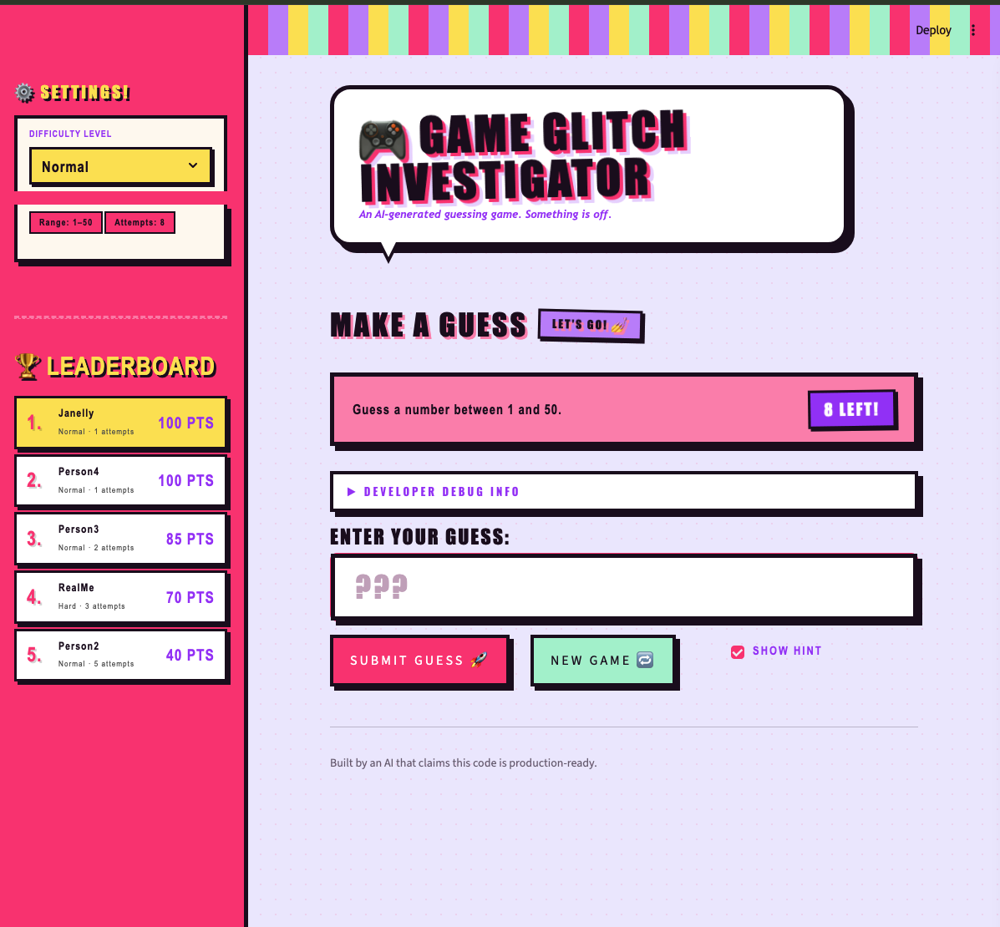
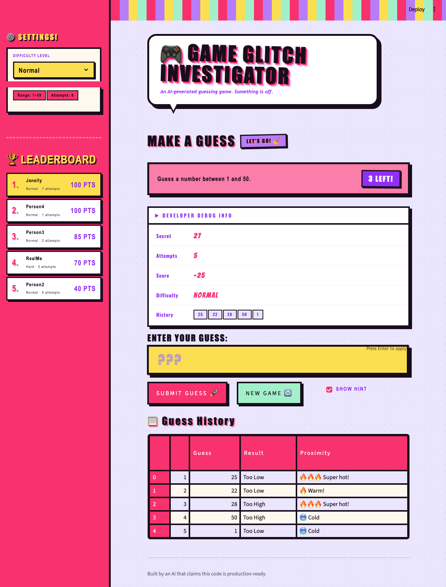
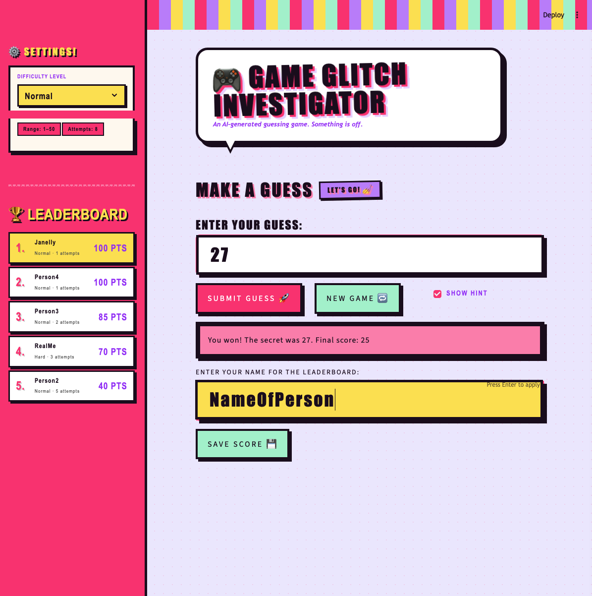

# 🎮 Game Glitch Investigator: The Impossible Guesser

## 🚨 The Situation

You asked an AI to build a simple "Number Guessing Game" using Streamlit.
It wrote the code, ran away, and now the game is unplayable.

- You can't win.
- The hints lie to you.
- The secret number seems to have commitment issues.

## 🛠️ Setup

1. Install dependencies: `pip install -r requirements.txt`
2. Run the broken app: `python -m streamlit run app.py`

## 🕵️‍♂️ Your Mission

1. **Play the game.** Open the "Developer Debug Info" tab in the app to see the secret number. Try to win.
2. **Find the State Bug.** Why does the secret number change every time you click "Submit"? Ask ChatGPT: _"How do I keep a variable from resetting in Streamlit when I click a button?"_
3. **Fix the Logic.** The hints ("Higher/Lower") are wrong. Fix them.
4. **Refactor & Test.** - Move the logic into `logic_utils.py`.
   - Run `pytest` in your terminal.
   - Keep fixing until all tests pass!

## 📝 Document Your Experience

- [ ] Describe the game's purpose.
- [ ] Detail which bugs you found.
- [ ] Explain what fixes you applied.

## ✨ Stretch Features Added

### Leaderboard

- Top scores are saved to a local `leaderboard.json` file after each game
- Displays the top 5 scores with player name, difficulty, attempts used, and score
- Persists across sessions so scores accumulate over time

## 📸 Demo

- 

## 🚀 Stretch Features

- 
- 
- 
